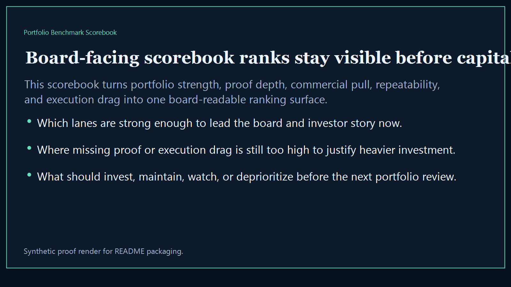
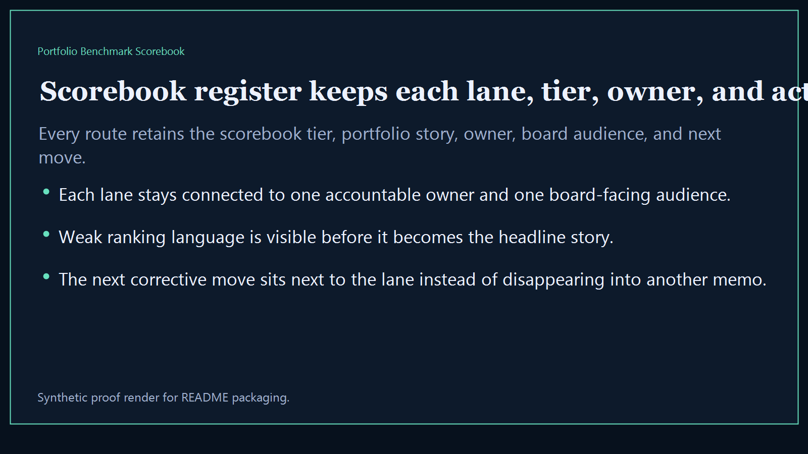
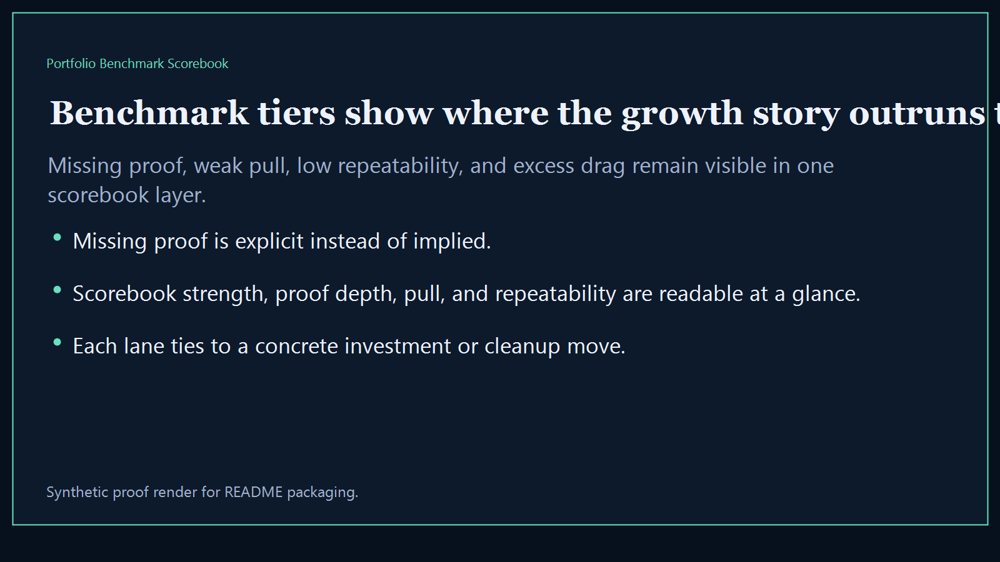
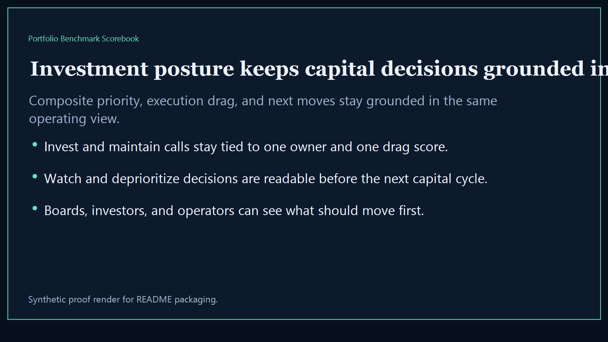

# Portfolio Benchmark Scorebook

Board-ready executive-intelligence surface for ranking the broader Kinetic Gain portfolio into one reusable benchmark scorebook.

- Live: `https://scorebook.kineticgain.com/`
- Repo: `mizcausevic-dev/portfolio-benchmark-scorebook`

## Why this matters

Leaders need one scorebook that ranks the broader portfolio, shows which lanes deserve top billing, and makes investment and storytelling tradeoffs legible before the next board or investor review.

## What it includes

- TypeScript executive-intelligence surface for ranking portfolio lanes, benchmark tiers, and investment posture
- synthetic lanes across multiple sectors, scorebook tiers, and board-visible comparison dimensions
- reusable outputs for scorebook register, benchmark tiers, investment posture, and board-ready portfolio narratives
- prerendered static site, JSON payloads, screenshots, and docs

## Routes

- `/`
- `/scorebook-register`
- `/benchmark-tiers`
- `/investment-posture`
- `/verification`
- `/docs`

## Local run

```bash
cd portfolio-benchmark-scorebook
npm install
npm run verify
npm run prerender
npm run render:assets
```

## CLI

```bash
npx portfolio-benchmark-scorebook fixtures/portfolio-benchmark-scorebook.json --format summary
npx portfolio-benchmark-scorebook fixtures/portfolio-benchmark-scorebook-clean.json --format json
```

## Docs

- [Architecture](docs/architecture.md)
- [Origin](docs/ORIGIN.md)
- [Kinetic Gain Embedded](docs/KINETIC_GAIN_EMBEDDED.md)

## Screenshots





